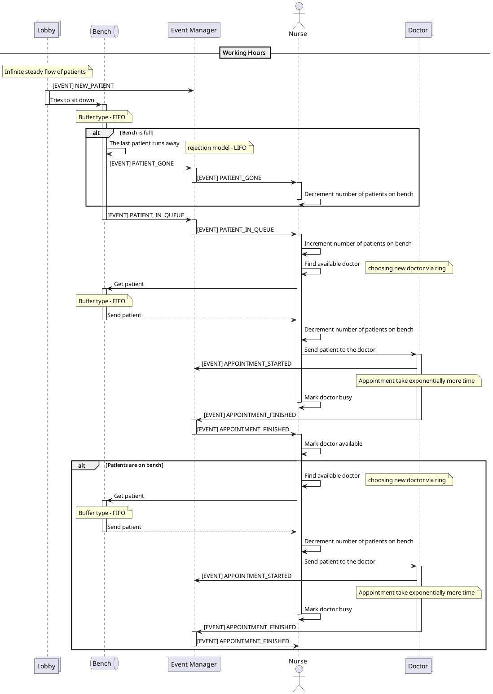
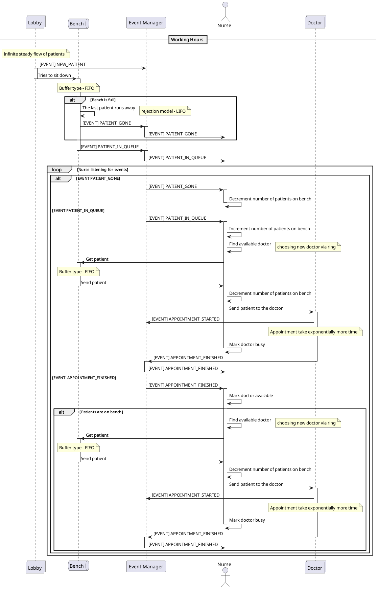

# Тут находится вся архитектура проекта
## Вариант 20
- Источники:
  - ИБ -бесконечный
  - И32- равномерный
- Приборы:
  - П31 -экспоненциальный
- Функции диспетчера:
  - Д1032 - Буферизации. Постановка заявки в буфер в порядке поступления.
  - Если в момент поступления заявок в систему все приборы оказываются занятыми, заявка последовательно занимает места в буфере памяти, начиная с первого.
  - В случае освобождения какого-либо места в БП с номером N (заявка уходит на обслуживание или получает отказ), все заявки, стоящие на местах, начиная с (N+1), сдвигаются на одно место. Следующая заявка, вынужденная встать в очередь, всегда будет ставиться в ее конец, пока есть свободные места.
  - Д10О4 - Отказ. Последняя поступившая в буфер. Самая последняя заявка из поступивших в буфер, т. е. заявка, меньше других простоявшая в очереди, выбивается из БП, и на её место встаёт пришедшая заявка.
  - Д2П2 - Выбор обслуживающего прибора. По кольцу
- Функции буферизации:
  - Д2Б1 - FIFO (первым пришел — первым обслужен). Заявка, дольше всех простоявшая в буфере, будет выбрана на обслуживание раньше других.
- Вывод метрик
  - ОР1 - сводная таблица результатов
  - ОД2 - формализованная схема модели, текущее состояние
## Домен
Поликлиника: 
  1) В поликлинику приходит пациент и получает талон в регистратуре
  2) Идет к нескольким кабинетам и садится на скамейку
  3) В определенный момент приходит медсестра и направляет пациента в кабинет к врачу.
  4) Врач проводит осмотр
  5) Если скамейка заполнена и приходит новый человек, то последний в очереди уступает ему место и уходит.
## Маппимнг СМО на домен
  1) Заявка - пациент с  талоном
  2) Источник - регистратура (поток пациентов равноменый)
  3) Диспетчер постановки (совмещеный с источником) - регистратура
  4) Буфер - скамейка
  5) Диспетчер выборки - медсестра (выбор прибора по кольцу)
  6) Прибор -врач (врачи устают -> время обработки заявки экспоненциальное)

## С4

## Sequence

## Sequence v2

## BMPN
Тут для простоты опустил Event Manager т.к. он занимается только пересылкой событий

